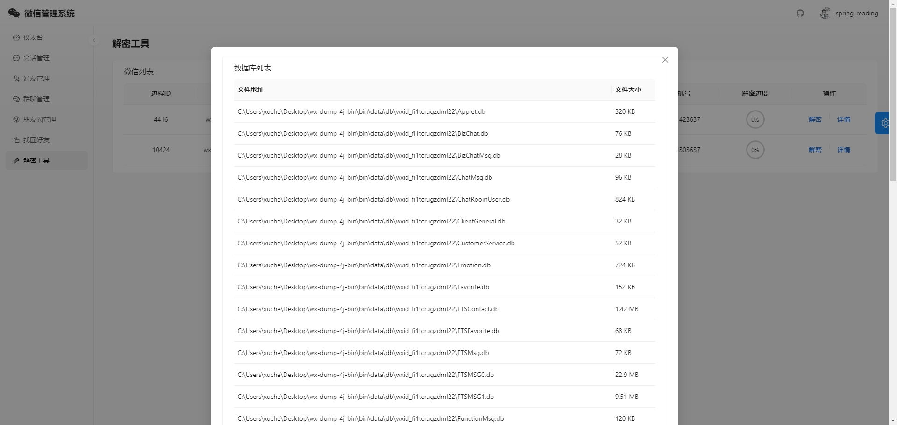

<p align="center">
	<a href="https://wx.xxccss.com/"></a>
</p>

<p align="center">
	<strong>🍬Java版微信聊天记录备份与管理工具</strong>
</p>

<p align="center">
	👉 <a href="https://wx.xxccss.com/">https://wx.xxccss.com/</a> 👈
</p>

<p align="center">
	<a href="https://hellogithub.com/repository/5055dcceee434dc5851ac9897cb27396" target="_blank"></a>
</p>

<p align="center">
	<a href="https://github.com/xuchengsheng/spring-reading/stargazers"></a>
    <a href="https://github.com/xuchengsheng"></a>
    <a href="https://github.com/xuchengsheng/wx-dump-4j/fork"></a>
    <a href="https://github.com/xuchengsheng/wx-dump-4j/watchers"></a> 
</p>

<p align="center">
	
    
    
    
    
    
    
    
    
    
    
    
</p>

-------------------------------------------------------------------------------

## 📚 简介

wx-dump-4j是一款基于Java开发的微信数据分析工具。它准确显示好友数、群聊数和当日消息总量，提供过去15天每日消息统计，了解社交活跃度。识别展示最近一个月内互动频繁的前10位联系人。支持导出聊天记录、联系人、群聊信息，及查看**超过三天限制的朋友圈**历史记录和**找回微信好友**。

## 💡 主要功能

- 👤 **获取用户信息**：获取当前登录微信的详细信息，包括昵称、账号、手机号、邮箱、秘钥、微信Id。
- 💬 **支持多种消息类型**：管理微信聊天对话中的文本、引用、图片、表情、卡片链接、系统消息等。
- 📊 **综合管理**：提供微信会话、联系人、群聊与朋友圈的全面管理功能。
- 📥 **记录导出**：支持导出微信聊天记录、联系人、已删除好友和群聊信息，便于备份和管理。
- 📅 **查看历史朋友圈**：突破三日限制，查看更久以前的朋友圈历史记录，方便回顾和管理。
- 📈 **微信统计功能**：展示微信好友数、群聊数及今日收发消息总量，了解社交活跃度。
- 📊 **消息统计**：统计过去15天内每日微信消息数量，掌握长期消息交流情况。
- 🔝 **互动联系人**：展示最近一个月互动最频繁的前10位联系人，了解重要社交联系。
- 🧩 **消息类别占比**：展示微信消息类别占比图表，分析不同类型消息的占比情况。
- ☁️ **关键字词云**：展示微信最近使用的关键字词云图，分析聊天内容重点。
- 🔄 **找回已删除好友**：支持找回已删除的微信好友，恢复重要联系人。
- 🖥️ **微信多开支持**：支持微信多开功能，方便管理多个账号，提高效率。

## 🚀 快速启动

本指南将帮助您快速启动并运行项目，无论是安装包部署还是本地部署。

### 环境准备

在开始之前，请确保您的开发环境满足以下要求：

- 安装 [Java](https://repo.huaweicloud.com/java/jdk/11.0.2+9/jdk-11.0.2_windows-x64_bin.exe)，版本为 JDK 11+。
- 安装 [Node.js](https://nodejs.org/en/)，版本为 18+。
- 安装 [Maven](https://maven.apache.org/download.cgi)，版本为 3.5.0+。
- 选择一款开发工具，比如 IntelliJ IDEA。

### 二进制部署

- 点击下载最新版 [wx-dump-4j-bin.tar.gz](https://github.com/xuchengsheng/wx-dump-4j/releases/download/v1.1.0/wx-dump-4j-bin.tar.gz)。

- 解压缩 `wx-dump-4j-bin.tar.gz` 文件，并进入 `bin` 目录。

- 双击 `start.bat` 启动文件。

- 启动成功后，在浏览器中访问 [http://localhost:8080](http://localhost:8080) 以查看应用。

### 本地部署

- 下载源码：
   ```bash
   $ git clone https://github.com/xuchengsheng/wx-dump-4j.git
   ```
- 安装后端依赖：
   ```bash
   $ cd wx-dump-4j mvn clean install
   ```
- 使用开发工具（如 IntelliJ IDEA）启动 com.xcs.wx.WxDumpApplication。
- 安装前端依赖：
   ```bash
   $ cd wx-dump-ui npm install
   ```
- 启动前端服务：
   ```bash
   $ npm run start
   ```
- 前端服务启动成功后，在浏览器中访问 http://localhost:8000 以查看应用。

## ⚡ 技术栈
以下是本项目使用的技术栈：

| 技术         | 描述                      | 版本      |
|--------------|---------------------------|-----------|
| Spring Boot  | Web 和 Thymeleaf 框架     | 2.7.15    |
| SQLite       | 轻量级数据库              | 3.34.0    |
| Lombok       | 简化 Java 代码            | 1.18.20   |
| MyBatis Plus | ORM 框架扩展              | 3.5.4.1   |
| Dynamic Datasource | 动态数据源管理         | 4.2.0     |
| Druid        | 数据库连接池              | 1.2.20    |
| MapStruct    | Java Bean 映射工具        | 1.4.2.Final |
| Hutool       | Java 工具库               | 5.8.16    |
| JNA          | Java 本地访问             | 5.8.0     |
| Protobuf     | 序列化框架                | 3.25.1    |
| gRPC         | RPC 框架                  | 1.11.0    |
| EasyExcel    | Excel 操作工具            | 3.3.3     |
| Commons Compress | 压缩和解压缩工具    | 1.19      |
| Jackson Dataformat XML | XML 解析工具  | 2.13.5    |
| Commons Lang3 | 常用工具类库             | 3.12.0    |

## ⛔️️ 使用限制
本软件仅适用于Windows操作系统。我们目前不支持macOS、Linux或其他操作系统。如果你在尝试在非Windows系统上运行本软件时可能遇到兼容性问题，这些问题可能导致软件无法正常运行或产生其他意外后果。

| 操作系统 | 支持情况     |
|:--------:|:----------:|
| Windows  | 支持   |
| macOS    | 不支持     |
| Linux    | 不支持    |

## ⚠️免责声明

本软件仅供技术研究和教育目的使用，旨在解密用户个人微信聊天记录。严禁将本软件用于任何非法目的，包括但不限于侵犯隐私权或非授权数据访问。作为软件开发者，我不对因使用或滥用本软件产生的任何形式的损失或损害承担责任。

## ⛵欢迎贡献！

如果你发现任何错误🔍或者有改进建议🛠️，欢迎提交 issue 或者 pull request。你的反馈📢对于我非常宝贵💎！

## 💻我的 GitHub 统计

[](https://star-history.com/#xuchengsheng/wx-dump-4j&Date)

## 🎉Stargazers

[](https://github.com/xuchengsheng/wx-dump-4j/stargazers)

## 🎉Forkers

[](https://github.com/xuchengsheng/wx-dump-4j/network/members)

## 🍱请我吃盒饭？

作者晚上还要写博客✍️,平时还需要工作💼,如果帮到了你可以请作者吃个盒饭🥡
<div>


</div>

## ⭐️扫码关注微信公众号

关注后，回复关键字📲 **加群**📲，即可加入我们的技术交流群，与更多开发者一起交流学习。

在此，我们真诚地邀请您访问我们的GitHub项目页面，如果您觉得***wx-dump-4j***对您有帮助，请顺手点个⭐️**Star**⭐️！每一颗星星都是我们前进的动力，是对我们努力的最大肯定。非常感谢您的支持！

<div>
>
</div>

## 👀 演示图

<table>
    <tr>
        <td></td>
        <td></td>
    </tr>
    <tr>
        <td></td>
        <td></td>
    </tr>
    <tr>
        <td></td>
        <td></td>
    </tr>
	<tr>
        <td></td>
        <td></td>
    </tr>	 
	<tr>
        <td></td>
        <td></td>
    </tr>
</table>